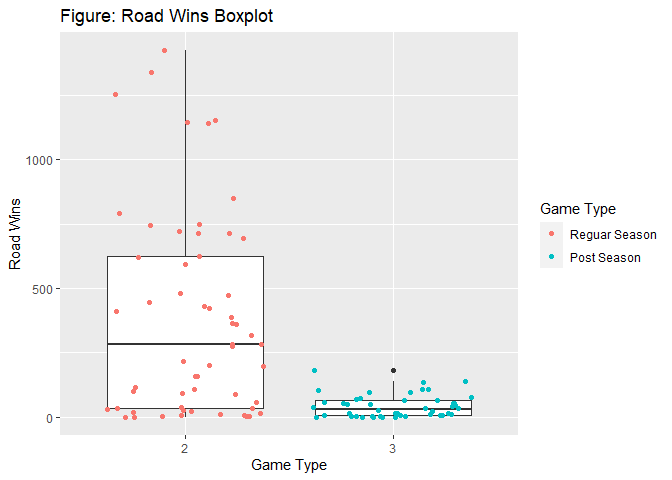
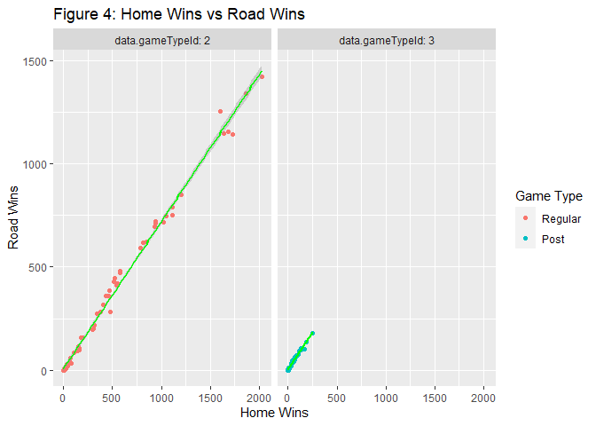
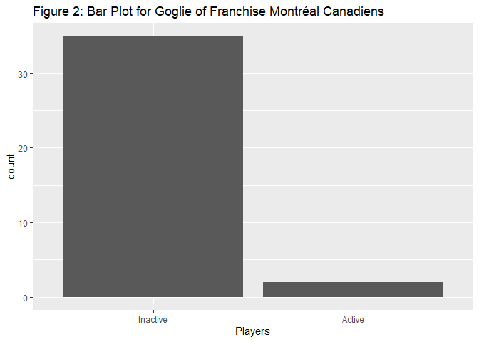

Project 1
================
Yuying Zhou
9/14/2020

  - [Needed Packages](#needed-packages)
  - [Create a function to read NHL
    records](#create-a-function-to-read-nhl-records)
  - [Create a function to read stats
    API](#create-a-function-to-read-stats-api)
  - [Create a wrapper function](#create-a-wrapper-function)
  - [Create datasets for use in the analysis
    later](#create-datasets-for-use-in-the-analysis-later)
  - [Explore data](#explore-data)
      - [Franchise Totals](#franchise-totals)
          - [Active Franchise Table](#active-franchise-table)
          - [Homewins Histogram Plot](#homewins-histogram-plot)
          - [Roadwins boxplot](#roadwins-boxplot)
          - [Homewins vs Roadwins Plot](#homewins-vs-roadwins-plot)
      - [Active Goalie from
        FranchiseID=1](#active-goalie-from-franchiseid1)
          - [Table](#table)
          - [Bar Plot](#bar-plot)

# Needed Packages

``` r
#load packageds
library(httr)
library(jsonlite)
library(tidyverse)
library(knitr)
```

# Create a function to read NHL records

``` r
#create a franchise lookup table with franchise name and franchise ID
base<- "https://records.nhl.com/site/api"
endpoint1<-"/franchise-season-records?cayenneExp=franchiseId"
call1<-paste0(base,endpoint1)
get1<-GET(call1)
get1_text<-content(get1,"text")
get1_json<-fromJSON(get1_text,flatten= TRUE)
get1_df<-as.data.frame(get1_json)
franchisetable<-select(get1_df,data.franchiseId, data.franchiseName)
flook<-franchisetable$data.franchiseId
names(flook)<-franchisetable$data.franchiseName

#create the function
# functions with endpoints, users can put endpoint 1-5 for different endpoints
records<-function(endpoint,franchise=NULL){
  base<- "https://records.nhl.com/site/api"
  if (endpoint==1){
      endpoint<-"/franchise"
      call<-paste0(base,endpoint)
      get<-GET(call)
      get_text<-content(get,"text")
      get_json<-fromJSON(get_text,flatten= TRUE)
      get_df<-as.data.frame(get_json)
  }
  else if (endpoint==2){
      endpoint<-"/franchise-team-totals"
      call<-paste0(base,endpoint)
      get<-GET(call)
      get_text<-content(get,"text")
      get_json<-fromJSON(get_text,flatten= TRUE)
      get_df<-as.data.frame(get_json)
  }
  else if (endpoint==3){
      endpoint<-"/franchise-season-records?cayenneExp=franchiseId"
      franchise<- ifelse(!is.numeric(franchise),unname(flook[franchise]),franchise)
      call<-paste0(base,endpoint,"=",franchise)
      get<-GET(call)
      get_text<-content(get,"text")
      get_json<-fromJSON(get_text,flatten= TRUE)
      get_df<-as.data.frame(get_json)
  }
  else if (endpoint==4){
      endpoint<-"/franchise-goalie-records?cayenneExp=franchiseId"
      franchise<- ifelse(!is.numeric(franchise),unname(flook[franchise]),franchise)
      call<-paste0(base,endpoint,"=",franchise)
      get<-GET(call)
      get_text<-content(get,"text")
      get_json<-fromJSON(get_text,flatten= TRUE)
      get_df<-as.data.frame(get_json)
  }
  else{
      endpoint<-"/franchise-skater-records?cayenneExp=franchiseId"
      franchise<- ifelse(!is.numeric(franchise),unname(flook[franchise]),franchise)
      call<-paste0(base,endpoint,"=",franchise)
      get<-GET(call)
      get_text<-content(get,"text")
      get_json<-fromJSON(get_text,flatten= TRUE)
      get_df<-as.data.frame(get_json)
  }
}

data1<-records(endpoint=1)
data2<-records(2)
data3<-records(3,"San Jose Sharks")
data4<-records(4,"San Jose Sharks")
data5<-records(5,"New Jersey Devils")
```

# Create a function to read stats API

``` r
#create a function to get stats
#Modifiers 1-8 represents different modifiers, no need to type modifiers strings
nhlstats<-function(modifiers,teamID=NULL,season=NULL,teams=NULL){
  base2<-"https://statsapi.web.nhl.com/api/v1/teams/"
  if (modifiers==1){
      modifiers<-"?expand=team.roster"
      call2<-paste0(base2,teamID,modifiers)
      get2<-GET(call2)
      get2_text<-content(get2,"text")
      get2_json<-fromJSON(get2_text,flatten= TRUE)
      get2_df<-as.data.frame(get2_json)
      get3_df<-get2_df%>%select(-teams.roster.roster)
      roster_df<-data.frame(get2_df$teams.roster.roster[[1]])
      get2_df<-cbind(get3_df,roster_df)
  }
  else if (modifiers==2){
      modifiers<-"?expand=person.names"
      call2<-paste0(base2,teamID,modifiers)
      get2<-GET(call2)
      get2_text<-content(get2,"text")
      get2_json<-fromJSON(get2_text,flatten= TRUE)
      get2_df<-as.data.frame(get2_json)
  }
  else if (modifiers==3){
      modifiers<-"?expand=team.schedule.next"
      call2<-paste0(base2,teamID,modifiers)
      get2<-GET(call2)
      get2_text<-content(get2,"text")
      get2_json<-fromJSON(get2_text,flatten= TRUE)
      get2_df<-as.data.frame(get2_json)
      if (!is.null(get2_df$teams.nextGameSchedule.dates)){
        get3_df<-get2_df%>%select(-teams.nextGameSchedule.dates)
        roster_df<-data.frame(get2_df$teams.nextGameSchedule.dates[[1]])
        game<-data.frame(roster_df$games[[1]])
        roster_df<-roster_df%>%select(-games)
        get2_df<-cbind(get3_df,roster_df,game)}
      else {
        get2_df<-as.data.frame(get2_json)
        return(get2_df)}
  }
  else if (modifiers==4){
      modifiers<-"?expand=team.schedule.previous"
      call2<-paste0(base2,teamID,modifiers)
      get2<-GET(call2)
      get2_text<-content(get2,"text")
      get2_json<-fromJSON(get2_text,flatten= TRUE)
      get2_df<-as.data.frame(get2_json)
      if (!is.null(get2_df$teams.previousGameSchedule.dates)){
          get3_df<-get2_df%>%select(-teams.previousGameSchedule.dates)
          
          roster_df<-data.frame(get2_df$teams.previousGameSchedule.dates[[1]])
          game<-data.frame(roster_df$games[[1]])
          roster_df<-roster_df%>%select(-games)
          get2_df<-cbind(get3_df,roster_df,game)}
     else {
          get2_df<-as.data.frame(get2_json)
          return(get2_df)}
   }
  else if (modifiers==5){
      modifiers<-"?expand=team.stats"
      call2<-paste0(base2,teamID,modifiers)
      get2<-GET(call2)
      get2_text<-content(get2,"text")
      get2_json<-fromJSON(get2_text,flatten= TRUE)
      get2_df<-as.data.frame(get2_json)
      roster_df<-data.frame(get2_df$teams.teamStats[[1]])
      game<-data.frame(roster_df$splits[[1]])
      roster<-cbind(get2_df,roster_df,game)
      get2_df<-roster%>%select(-c(splits,teams.teamStats))
  }
  else if (modifiers==6){
      modifiers<-"?expand=team.roster&season"
      call2<-paste0(base2,teamID,modifiers,"=",season)
      get2<-GET(call2)
      get2_text<-content(get2,"text")
      get2_json<-fromJSON(get2_text,flatten= TRUE)
      get2_df<-as.data.frame(get2_json)
      roster_df<-data.frame(get2_df$teams.roster.roster[[1]])
      roster<-cbind(get2_df,roster_df)
      get2_df<-roster%>%select(-teams.roster.roster)
  }
  else if (modifiers==7){
      base2<-"https://statsapi.web.nhl.com/api/v1/teams"
      modifiers<-"?teamId"
      # team<- ifelse(!is.numeric(team),unname(tlook[team]),team)
      call2<-paste0(base2,modifiers,"=",teams)
      get2<-GET(call2)
      get2_text<-content(get2,"text")
      get2_json<-fromJSON(get2_text,flatten= TRUE)
      get2_df<-as.data.frame(get2_json)
  }
  else if (modifiers==8){
      base2<-"https://statsapi.web.nhl.com/api/v1/teams"
      modifiers<-"?stats=statsSingleSeasonPlayoffs"
      call2<-paste0(base2,modifiers)
      get2<-GET(call2)
      get2_text<-content(get2,"text")
      get2_json<-fromJSON(get2_text,flatten= TRUE)
      get2_df<-as.data.frame(get2_json)
    }
}  

stat1<-nhlstats(modifiers = 1,teamID = 14)
stat2<-nhlstats(modifiers = 2,teamID = 14)
stat3<-nhlstats(modifiers = 3, teamID =25)
stat4<-nhlstats(modifiers = 4, teamID = 1)
stat5<-nhlstats(modifiers = 5,teamID = 1)
stat6<-nhlstats(modifiers = 6, teamID=14,season = "20112012")
stat7<-nhlstats(modifiers = 7,teams = "4,5")
stat8<-nhlstats(modifiers = 8)
```

# Create a wrapper function

``` r
stopshop<-function(endpoint=NULL, franchise=NULL, modifiers=NULL,teamID=NULL, teams=NULL,season=NULL){
  if(!is.null(endpoint)){
  record<-records(endpoint,franchise)}
  else if (!is.null(modifiers)){
  stat<-nhlstats(modifiers,teamID,season,teams)
  }}
```

# Create datasets for use in the analysis later

``` r
#create a dataset from API records endpoint franchise-team-totals
franchisetotals<-stopshop(endpoint = 2)
l<-stopshop(endpoint = 3,franchise = 1)
#create a goalie dataset for franchise ID 1 
goalie<-stopshop(endpoint = 4, franchise = 1)
goalie<-as.tibble(goalie)
#create a skater dataset for franchise name Montréal Canadiens
skater<-stopshop(endpoint = 5, franchise = "Montréal Canadiens")
#create a dataset for team1 stats
stats_team1<-stopshop(modifiers = 5,teamID = 1)
```

# Explore data

## Franchise Totals

### Active Franchise Table

There are 38 franchises. They play 31 games since they are established,
including regular and post seasons. Some franchises have more than 1
teams in the history. Of 31 games, 18 were played by inacitive
franchise, 13 are with gameType of 2 and 5 are with gameType of 3.

``` r
#convert activeFranchise and typeID to a factor
franchisetotals$data.activeFranchise<-as.factor(franchisetotals$data.activeFranchise)
franchisetotals$data.gameTypeId<-as.factor(franchisetotals$data.gameTypeId)
active<-table(franchisetotals$data.activeFranchise,franchisetotals$data.gameTypeId)
active_2<-kable(active, caption = "TABLE 1: Franchise Played Games in History",col.names = c("Regular Season","Post Season"))
active_2
```

|   | Regular Season | Post Season |
| :- | -------------: | ----------: |
| 0 |             13 |           5 |
| 1 |             44 |          43 |

TABLE 1: Franchise Played Games in History

### Homewins Histogram Plot

I looked at homewins districution acorss all franchies. As shown in the
Figure below, the density decreases as number of wins increases. Aslo,
there are more home wins in regular season.

``` r
g<-ggplot(data=franchisetotals,aes(x=data.homeWins))
g+geom_histogram(aes(y=..density..,fill=as.factor(data.gameTypeId)),binwidth = 200)+scale_fill_discrete(name="Game Type",labels=c("Regular Season","Post Season"))+geom_density( alpha=0.5,color="red",lwd=1,outline.type = "full",aes(fill=as.factor(data.gameTypeId)),position = "stack")+labs(y="Density",x="Home Wins",title="Figure 1: Histogram of Home Wins for All Franchises")
```

<!-- -->

### Roadwins boxplot

As shown in the figure below, there are more road wins during regular
season than post regular season.

``` r
g<-ggplot(data=franchisetotals,aes(y=data.roadWins,x=as.factor(data.gameTypeId)))
g+geom_boxplot()+geom_jitter(aes(color= as.factor(data.gameTypeId)))+scale_color_discrete(name="Game Type",labels=c("Reguar Season","Post Season"))+labs(x="Game Type",y="Road Wins",title="Figure 3: Road Wins Boxplot")
```

<!-- -->

### Homewins vs Roadwins Plot

As shown in Figure 4, road wins and home wins are highly correlated. THe
relaitonship is linear and postive.

``` r
g<-ggplot(data=franchisetotals,aes(x=data.homeWins,y=data.roadWins))
g+geom_point(aes(group=as.factor(data.gameTypeId),color=as.factor(data.gameTypeId)))+geom_smooth(method=lm,aes(group=as.factor(data.gameTypeId)),color="green")+facet_wrap(~data.gameTypeId,labeller = label_both)+labs(title="Figure 4: Home Wins vs Road Wins",x="Home Wins",y="Road Wins")+scale_color_discrete (name="Game Type",labels=c("Regular","Post"))
```

<!-- -->

## Active Goalie from FranchiseID=1

### Table

There are 37 in the franchise “Montréal Canadiens” and 788 in the
franchise "“Montréal Canadiens”". 35 goalie retired from the franchise.

``` r
goalie_table<-kable(table(goalie$data.activePlayer), caption = "TABLE 2: Goalie of Montréal Canadiens", col.names = c("active player","count"))
goalie_table
```

| active player | count |
| :------------ | ----: |
| FALSE         |    35 |
| TRUE          |     2 |

TABLE 2: Goalie of Montréal Canadiens

### Bar Plot

As shown in Figure, 35 goalie were retired and 2 goalie are active.

``` r
g<-ggplot(data=goalie,aes(x=data.activePlayer))
g+geom_bar()+labs(x="Players", title = "Figure 2: Bar Plot for Goglie of Franchise Montréal Canadiens")+scale_x_discrete(labels=c("Inactive","Active"))
```

<!-- -->
